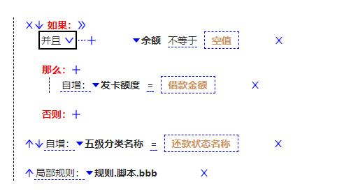

# 试用

```
git clone https://gitee.com/engalar/mendix-custom-widget-poc1.git --depth=1 ./dummy && cd ./dummy && git clone https://gitee.com/engalar/mendix-testproject-800.git --depth=1 ./tests/testProject && rd /s /q  .\tests\testProject\.git && xcopy dummy .\tests\testProject /E /Y && start tests/testProject/testProject.mpr
```

# 开发

```
git clone --recurse-submodules https://gitee.com/engalar/mendix-custom-widget-poc1.git.&& npm run m && npm run x && npm run testProject && npm run start
```


